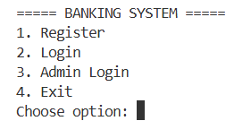
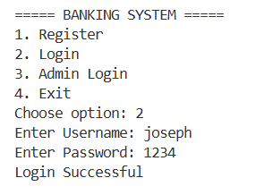
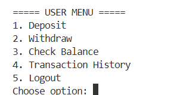
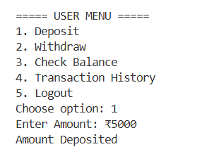
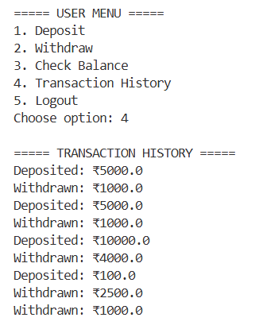
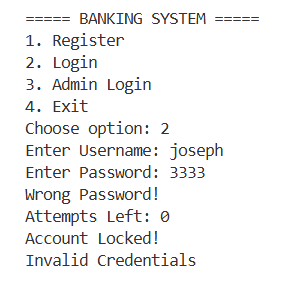
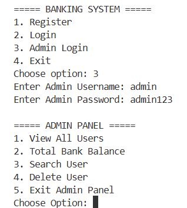
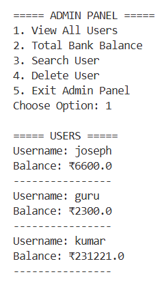
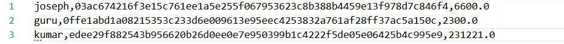
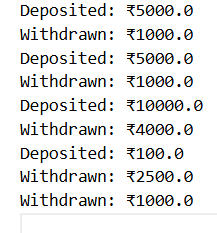

<h1 align="center">🏦 Secure Banking System</h1>

<h3 align="center">
Advanced Core Java Banking Application 🚀
</h3>

<p align="center">


</p>

---

<p align="center">


</p>

---

<p align="center">


</p>

---

# 🚀 About Project

A professional and secure **console-based Banking Management System** developed using Java.

This project demonstrates:

✅ Object-Oriented Programming  
✅ File Handling  
✅ Collections Framework  
✅ SHA-256 Password Encryption  
✅ Transaction Logging  
✅ Exception Handling  
✅ Admin Panel Management  

---

# ✨ Features

<div align="center">

| Feature | Status |
|----------|--------|
| User Registration | ✅ |
| Secure Login System | ✅ |
| Deposit Money | ✅ |
| Withdraw Money | ✅ |
| Balance Check | ✅ |
| Transaction History | ✅ |
| SHA-256 Encryption | ✅ |
| Login Attempt Limit | ✅ |
| Account Lock System | ✅ |
| File Handling | ✅ |
| Admin Panel | ✅ |
| Search User | ✅ |
| Delete User | ✅ |
| Exception Handling | ✅ |

</div>

---

# 🎞️ Tech Stack

<p align="center">


</p>

<p align="center">


</p>


---

# 📂 Project Structure

```bash
secure-banking-system-java
│
├── screenshots
│   ├── main-menu.png
│   ├── login-success.png
│   ├── user-menu.png
│   ├── deposit.png
│   ├── withdraw.png
│   ├── transaction-history.png
│   ├── account-lock.png
│   ├── admin-panel.png
│   ├── view-users.png
│   └── users-file.png
│
├── src
│   ├── data
│   │   ├── users.txt
│   │   └── transactions_joseph.txt
│   │
│   ├── model
│   │   └── User.java
│   │
│   ├── service
│   │   └── BankService.java
│   │
│   ├── util
│   │   ├── FileUtil.java
│   │   └── SecurityUtil.java
│   │
│   └── Main.java
│
├── README.md
└── .gitignore
```

# ⚡ How To Run

## 1️⃣ Clone Repository

```bash
git clone https://github.com/codefuser/secure-banking-system-java.git
```

---

## 2️⃣ Open Project

Open project in VS Code.

---

## 3️⃣ Compile Project

```bash
cd src
javac Main.java
```

---

## 4️⃣ Run Project

```bash
java Main
```

---

# 📸 Project Screenshots

---

## 🖥️ Main Menu

<p align="center">

</p>

---

## 🔐 Login Success

<p align="center">

</p>

---

## 👤 User Menu

<p align="center">

</p>

---

## 💰 Deposit System

<p align="center">

</p>

---

## 💸 Withdraw System

<p align="center">

</p>

---

## 📜 Transaction History

<p align="center">

</p>

---

## 🔒 Account Lock Security

<p align="center">

</p>

---

## 👑 Admin Panel

<p align="center">

</p>

---

## 👥 View Users

<p align="center">

</p>

---

## 🗄️ Users File

<p align="center">

</p>

---

## 📄 Transaction File

<p align="center">

</p>

---

# 📚 Concepts Used

<div align="center">

| Concept | Used |
|----------|------|
| OOP Concepts | ✅ |
| Collections Framework | ✅ |
| File Handling | ✅ |
| SHA-256 Encryption | ✅ |
| Exception Handling | ✅ |
| Validation Logic | ✅ |
| Authentication System | ✅ |
| Admin Panel | ✅ |

</div>

---

# 🌟 Support This Project

<p align="center">


</p>

---

# ❤️ Give Support

<p align="center">

<a href="https://github.com/codefuser/secure-banking-system-java">

</a>

<a href="https://github.com/codefuser/secure-banking-system-java/fork">

</a>

</p>

---

# 🌐 Connect With Me

<p align="center">

<a href="https://github.com/codefuser">

</a>

<a href="https://www.linkedin.com/in/joseph-fullstack/">

</a>

</p>

---

# 🚀 Future Improvements

🔹 GUI Version using Java Swing  
🔹 Database Integration (MySQL)  
🔹 Interest Calculation  
🔹 Online Banking Features  
🔹 Email Notifications  
🔹 ATM Simulation  

---

# 👨‍💻 Author

<h3 align="center">Joseph</h3>

<p align="center">


</p>

---

<h2 align="center">
🔥 Thank You For Visiting My Project 🔥
</h2>

<p align="center">


</p>